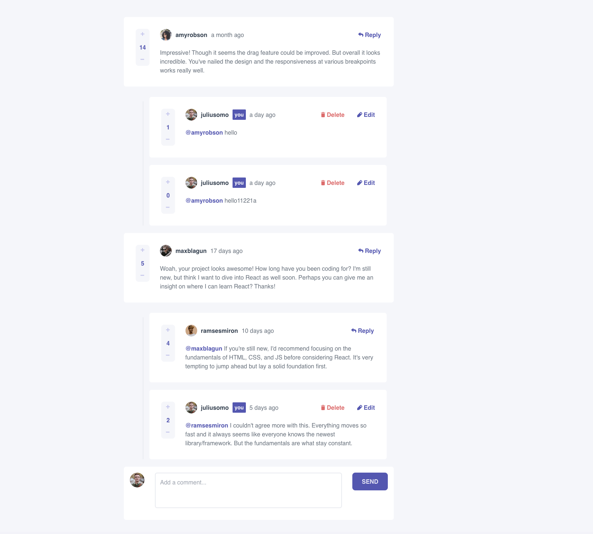
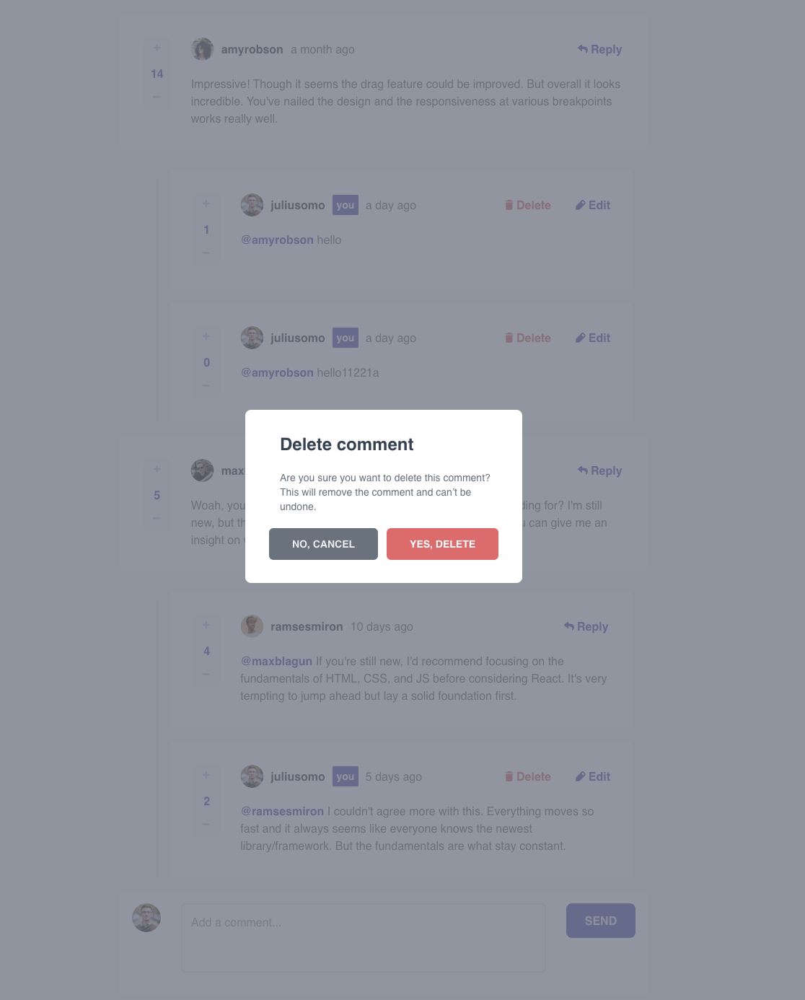
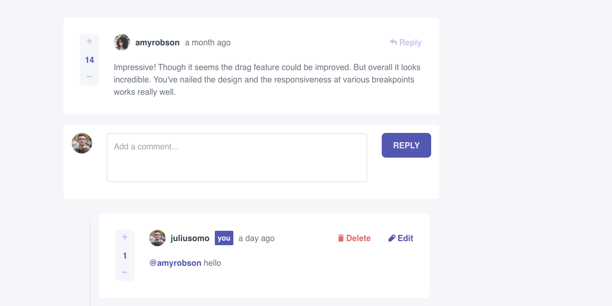
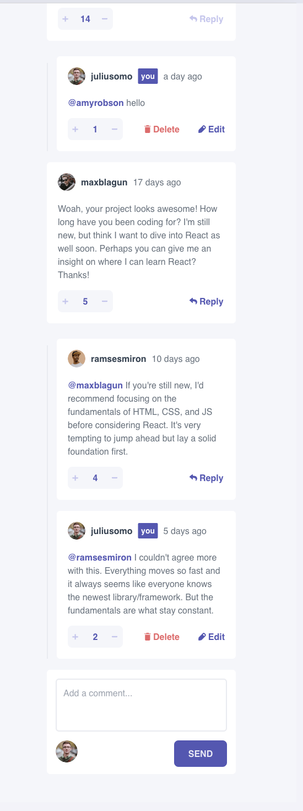

# Frontend Mentor - Interactive comments section solution

This is a solution to the [Interactive comments section challenge on Frontend Mentor](https://www.frontendmentor.io/challenges/interactive-comments-section-iG1RugEG9). Frontend Mentor challenges help you improve your coding skills by building realistic projects.

## Table of contents

- [Overview](#overview)
  - [The challenge](#the-challenge)
  - [Screenshot](#screenshot)
  - [Links](#links)
- [My process](#my-process)
  - [Built with](#built-with)
- [Author](#author)

## Overview

### The challenge

Users should be able to:

- View the optimal layout for the app depending on their device's screen size
- See hover states for all interactive elements on the page
- Create, Read, Update, and Delete comments and replies
- Upvote and downvote comments
- Data saves to `localStorage` that persists when the browser is refreshed.
- `createdAt` are timestamps and dynamically track the time since the comment or reply was posted.

### Screenshot

#### Desktop

#### Mobile

### Links

- Solution URL: [Link](https://interactive-comments-pearl.vercel.app/)
- Live Site URL: [Add live site URL here](https://your-live-site-url.com)

## My process

### Built with

- Mobile-first workflow
- [React](https://reactjs.org/) - JS library
- [Vite](https://vitejs.dev/) - build tool
- [Tailwindcss](https://tailwindcss.com/) - for styles
- [Moment.js](https://momentjs.com/) - for dates

## Author

- Frontend Mentor - [@AnnaPrusakova](https://www.frontendmentor.io/profile/AnnaPrusakova)
